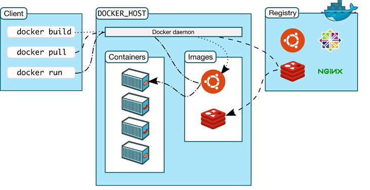

## Docker

Arquitetura
> 

#

`-it` - modo interativo
```
docker container run -it ubuntu /bin/bash
docker run -it ubuntu /bin/bash

docker exec -it id-container /bin/bash
```

#

`-d` - execução em background
```
docker run nginx
docker run -d nginx
```

#

`-p <host>:<container>` - mapeamento de portas
```
docker container run -d -p 8080:80 nginx
```

#
